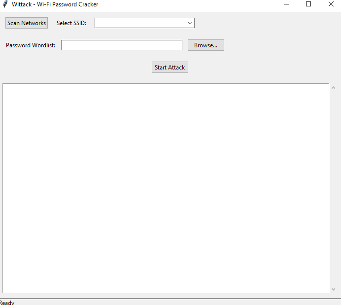

# WITTACK — Wi-Fi Credential Audit Tool

> A cross-platform Python CLI utility that tests credential resilience against Wi-Fi networks using native OS tools (`netsh` / `nmcli` / `airport`) and optimized fast-polling loops.

[](https://python.org)
[](https://github.com/abheetsharma09/wittack)
[](LICENSE)

---

## Table of Contents

- [Quick Start](#quick-start)
- [Requirements](#requirements)
- [Installation](#installation)
- [Preparing Your Wordlist](#preparing-your-wordlist)
- [Running Wittack](#running-wittack)
  - [Windows (EXE)](#option-a--windows-exe-recommended)
  - [Windows (Python)](#option-b--windows-python-script)
  - [macOS](#macos)
  - [Linux](#linux)
- [Using the Tool — Step by Step](#using-the-tool--step-by-step)
- [Understanding the Output](#understanding-the-output)
- [Troubleshooting](#troubleshooting)
- [How It Works Internally](#how-it-works-internally)
- [Legal & Ethical Policy](#legal--ethical-policy)
- [Wittack Basic GUI(Tkinter)](#wittack-guitkinter)

---

## Quick Start

```
# Windows — just double-click wittack.exe (run as Administrator)
# OR from command line:
wittack.exe

# macOS / Linux — run with sudo
sudo python3 main_script.py
```

---

## Requirements

| Requirement | Detail |
|---|---|
| **Python** | Version 3.6 or higher (not needed if using the `.exe`) |
| **OS** | Windows 10/11 · macOS 10.14+ · Ubuntu/Debian/Arch Linux |
| **Privileges** | Administrator (Windows) or root/sudo (macOS/Linux) |
| **Wi-Fi** | Machine must have a working Wi-Fi adapter |
| **Python dependency** | `colorama` — colored terminal output |

---

## Installation

### Option A — Windows EXE (No Python Required)

1. Go to the [Releases page](https://github.com/abheetsharma09/wittack/releases)
2. Download `wittack.exe` from the latest release
3. Place it in a folder of your choice — no installation needed
4. Right-click the `.exe` → **Run as administrator**

That is all. No Python, no pip, no setup.

---

### Option B — Python Script (All Platforms)

**Step 1 — Clone or download the repo**

```bash
git clone https://github.com/abheetsharma09/wittack.git
cd wittack
```

Or click **Code → Download ZIP** on GitHub, then extract it.

**Step 2 — Install the one required dependency**

```bash
pip install colorama
```

If you are on Linux or macOS and `pip` points to Python 2:

```bash
pip3 install colorama
```

**Step 3 — Verify Python version**

```bash
python --version
# Must be 3.6 or higher
# On macOS/Linux use: python3 --version
```

---

## Preparing Your Wordlist

Wittack reads passwords from a plain text file — one password per line.

**Example `passwords.txt`:**

```
12345678
password123
mysecretnetwork
qwerty123
letmein99
hunter2wifi
```

**Rules the script enforces automatically:**

- Any password **under 8 characters is silently skipped** — this is the WPA2 minimum requirement. Including them wastes time.
- Blank lines are ignored.
- Malformed or non-UTF-8 characters in the file are ignored without crashing.

**Where to get wordlists:**

- `rockyou.txt` — the most commonly used wordlist for Wi-Fi auditing. Available on [GitHub](https://github.com/brannondorsey/naive-hashcat/releases/download/data/rockyou.txt) and pre-installed on Kali Linux at `/usr/share/wordlists/rockyou.txt`
- Build your own — if you are auditing your own network, include variations of your own password to verify it holds up

**Pro tip:** A smaller, targeted wordlist (100–1000 entries) is far more practical than a 10 million entry file. The speed of each attempt is governed by your hardware's Wi-Fi handshake time, not the script.

---

## Running Wittack

### Option A — Windows EXE (Recommended)

**Step 1** — Open File Explorer and navigate to where you saved `wittack.exe`

**Step 2** — Right-click `wittack.exe` → click **"Run as administrator"**

> You must run as administrator. The script needs to create and modify Wi-Fi network profiles in the Windows network stack. Without admin rights it will fail immediately.

**Step 3** — A UAC (User Account Control) prompt will appear. Click **Yes**.

The terminal window opens automatically and the tool starts scanning for nearby networks.

---

### Option B — Windows Python Script

**Step 1** — Open the Start Menu → search for **Command Prompt** → right-click it → **Run as administrator**

**Step 2** — Navigate to the wittack folder:

```cmd
cd C:\Users\YourName\Downloads\wittack
```

**Step 3** — Run the script:

```cmd
python main_script.py
```

If Windows asks for a UAC prompt, click Yes.

---

### macOS

**Step 1** — Open **Terminal** (Applications → Utilities → Terminal)

**Step 2** — Navigate to the wittack folder:

```bash
cd ~/Downloads/wittack
```

**Step 3** — Run with sudo:

```bash
sudo python3 main_script.py
```

**Step 4** — Enter your Mac login password when prompted. The script does not display characters as you type — this is normal.

> **Note for macOS 12+:** Apple restricts use of the `airport` utility on newer macOS versions. If network scanning returns no results, see the [Troubleshooting](#troubleshooting) section.

---

### Linux

**Step 1** — Open a terminal

**Step 2** — Make sure NetworkManager is installed:

```bash
# Debian / Ubuntu
sudo apt install network-manager

# Arch
sudo pacman -S networkmanager

# Fedora
sudo dnf install NetworkManager
```

**Step 3** — Navigate to the wittack folder:

```bash
cd ~/Downloads/wittack
```

**Step 4** — Run with sudo:

```bash
sudo python3 main_script.py
```

---

## Using the Tool — Step by Step

Once the script is running, here is exactly what happens and what you need to type at each prompt.

---

**Step 1 — The banner prints**

```
        .__  __    __                 __    
__  _  _|__|/  |__/  |______    ____ |  | __
\ \/ \/ /  \   __\   __\__  \ _/ ___\|  |/ /
 \     /|  ||  |  |  |  / __ \\  \___|    < 
  \/\_/ |__||__|  |__| /____  /\___  >__|_ \
                            \/     \/     \/
```

This confirms the script launched successfully with proper permissions.

---

**Step 2 — Network scan runs automatically**

```
Scanning for nearby Wi-Fi networks...
------------------------------
Found 4 network(s):

[0] HomeWiFi_5G
[1] NeighbourBT
[2] OfficeGuest
[3] AndroidHotspot
------------------------------
```

The tool calls `netsh` / `nmcli` / `airport` automatically depending on your OS and lists every visible SSID with an index number.

---

**Step 3 — Choose your target network**

```
Choose SSID to Launch Attack :
```

Type the **number** in the square brackets next to the network you want to test. For example, to test `HomeWiFi_5G` you would type:

```
0
```

Then press **Enter**.

> Only type the number. Do not type the SSID name. If you enter a number outside the range shown, the tool will print an error and exit — just run it again.

---

**Step 4 — Provide the wordlist path**

```
Enter the Password File Path (.txt) :
```

Type the full path to your password file. Examples:

**Windows:**
```
C:\Users\YourName\Desktop\passwords.txt
```

**macOS / Linux:**
```
/home/yourname/passwords.txt
```

Or if the file is in the same folder as the script, just type the filename:
```
passwords.txt
```

Then press **Enter**.

> If the file path is wrong or the file does not exist, the tool prints `File does not exist.` and exits. Check the path and run again.

---

**Step 5 — The attack loop starts**

```
Started attacking on HomeWiFi_5G...
Combinations Attempted: 1,000
```

The counter updates every 1,000 attempts. This is intentional — printing every single attempt would slow the loop significantly. Let it run. Speed depends entirely on your Wi-Fi hardware's connection handshake time, not the script.

Do not close the terminal. Do not put the machine to sleep.

---

**Step 6A — Password found**

If a password in your wordlist matches:

```
--------------------
PASSWORD FOUND : correctpassword123
--------------------
Saved the Details in 'output.txt'

PRESS ENTER TO EXIT
```

The matched credential is saved to `output.txt` in the same folder as the script, formatted as:

```
HomeWiFi_5G : correctpassword123
```

Press **Enter** to exit cleanly.

---

**Step 6B — Wordlist exhausted**

If the entire wordlist is tried without a match, the script finishes silently and exits. No match means the password was not in your list — not that the tool failed. Try a different or larger wordlist.

---

## Understanding the Output

| What you see | What it means |
|---|---|
| `Scanning for nearby Wi-Fi networks...` | OS network scan is running |
| `Found N network(s)` | Scan completed, N SSIDs discovered |
| `Started attacking on [SSID]...` | Loop has begun, reading your wordlist |
| `Combinations Attempted: X,000` | Counter — updates every 1,000 attempts |
| `PASSWORD FOUND : xxxx` | Match confirmed — credential written to `output.txt` |
| `File does not exist.` | The wordlist path you typed is wrong |
| `ERROR!!...Please choose from the given input!!` | You entered a number outside the network list range |
| No output after a long time | The script is working — large wordlists take time |

---

## Troubleshooting

**"Failed to add profile" on Windows**

You are not running as Administrator. Close the terminal, right-click Command Prompt or the `.exe`, and select *Run as administrator*.

---

**"No networks found" on any platform**

- Make sure your Wi-Fi adapter is turned on (not in Airplane mode)
- On Linux, confirm NetworkManager is running: `sudo systemctl start NetworkManager`
- On macOS 12+, the `airport` utility may be deprecated — run `sudo /System/Library/PrivateFrameworks/Apple80211.framework/Versions/Current/Resources/airport -s` manually to test if it works on your machine

---

**"nmcli not found" on Linux**

```bash
sudo apt install network-manager   # Ubuntu/Debian
sudo pacman -S networkmanager       # Arch
```

---

**The counter is moving very slowly**

This is normal. Each attempt requires a full OS-level WPA2 handshake cycle — typically 0.2–1.5 seconds per attempt depending on your hardware. A 1,000-entry wordlist can take anywhere from 3 minutes to 25 minutes. This is a hardware limitation, not a bug.

To speed things up: use a smaller, more targeted wordlist.

---

**Known valid password doesn't register as correct**

The connection polling window may be too short for your hardware. Open `main_script.py` and find the line:

```python
for _ in range(6):
```

Change `6` to `10` or `12` to give the connection more time to confirm:

```python
for _ in range(10):
```

---

**ANSI colour codes showing as garbled characters on Windows**

Run the script in **Windows Terminal** (not the legacy CMD window). Or confirm `colorama.init()` is being called — it is in the script by default.

---

**"Permission denied" on macOS or Linux**

You forgot `sudo`. The script must be run as root on POSIX systems:

```bash
sudo python3 main_script.py
```

---

**Script exits immediately after the UAC prompt on Windows**

This is expected behaviour. When the script detects it is not running as admin, it relaunches itself with elevated permissions via `ShellExecuteW runas` and exits the original process. The new elevated window is the one to use.

---

## How It Works Internally

The script follows this execution order every time:

```
Launch
  │
  ▼
Enforce admin/root privileges
  │  Windows: ctypes.windll.shell32.IsUserAnAdmin()
  │  POSIX:   os.geteuid() → re-exec with os.execvp sudo
  ▼
Scan nearby Wi-Fi networks
  │  Windows: netsh wlan show networks
  │  Linux:   nmcli -t -f SSID dev wifi list
  │  macOS:   airport -s
  ▼
User selects target SSID and provides wordlist path
  ▼
Password iteration loop
  │  Skip any password under 8 characters (WPA2 minimum)
  │  Counter printed every 1,000 attempts
  ▼
For each password — attempt connection
  │  Windows: Build WLANProfile XML → netsh wlan add profile
  │            → netsh wlan connect → poll 0.2s × 6 = 1.2s max
  │            → delete profile on failure
  │  macOS:   networksetup -setairportnetwork → poll → cleanup
  │  Linux:   nmcli dev wifi connect → verify with nmcli con show
  ▼
On success → write SSID:password to output.txt → exit
On failure → continue to next password in wordlist
```

---

## Wittack GUI(Tkinter)

- Quick and Simple GUI using Tkinter


## Legal & Ethical Policy

This utility is built **exclusively** for:

- Auditing Wi-Fi networks you own
- Recovering credentials for your own access points
- Authorized penetration testing engagements with written permission
- Educational research in controlled environments

**Unauthorized use against networks you do not own or do not have explicit written permission to test is illegal** under computer fraud and telecommunications laws in virtually every jurisdiction — including India's IT Act 2000, the US Computer Fraud and Abuse Act, and the UK Computer Misuse Act.

The maintainers accept no liability for misuse.

---

## License

MIT License — free to use, fork, and modify for all legitimate security auditing workflows. See [LICENSE](LICENSE) for the full text.

---

*Built by [abheetsharma09](https://github.com/abheetsharma09)*